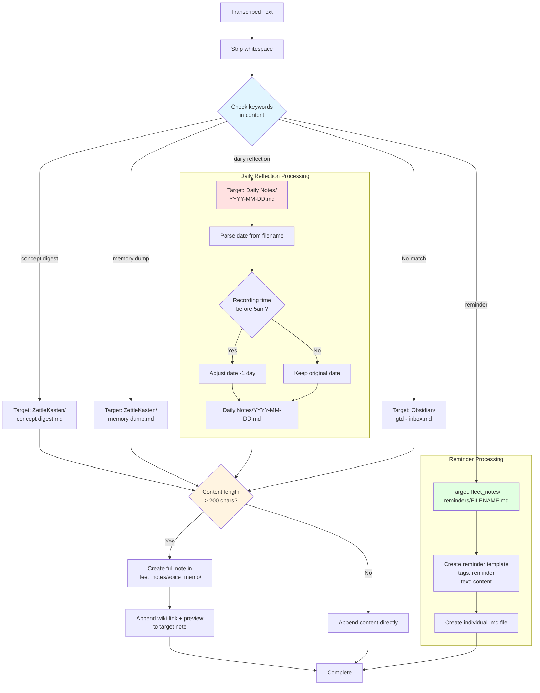
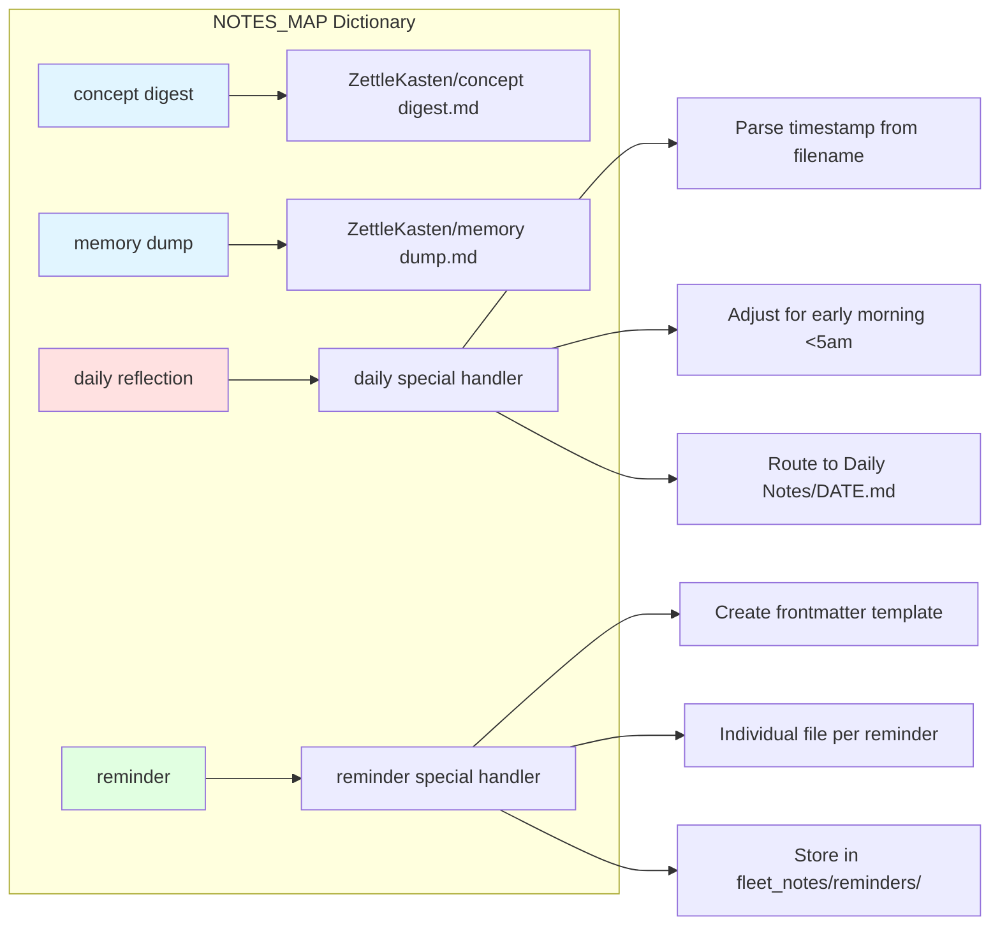
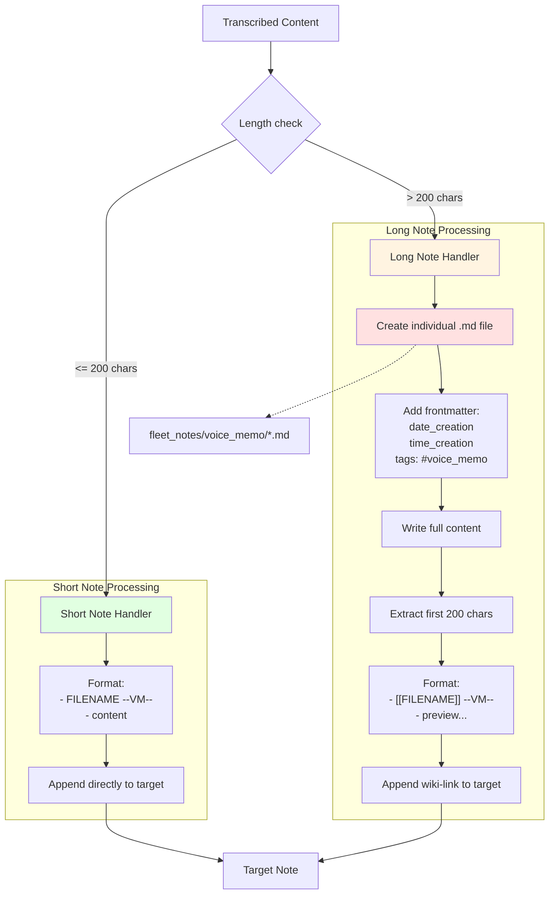
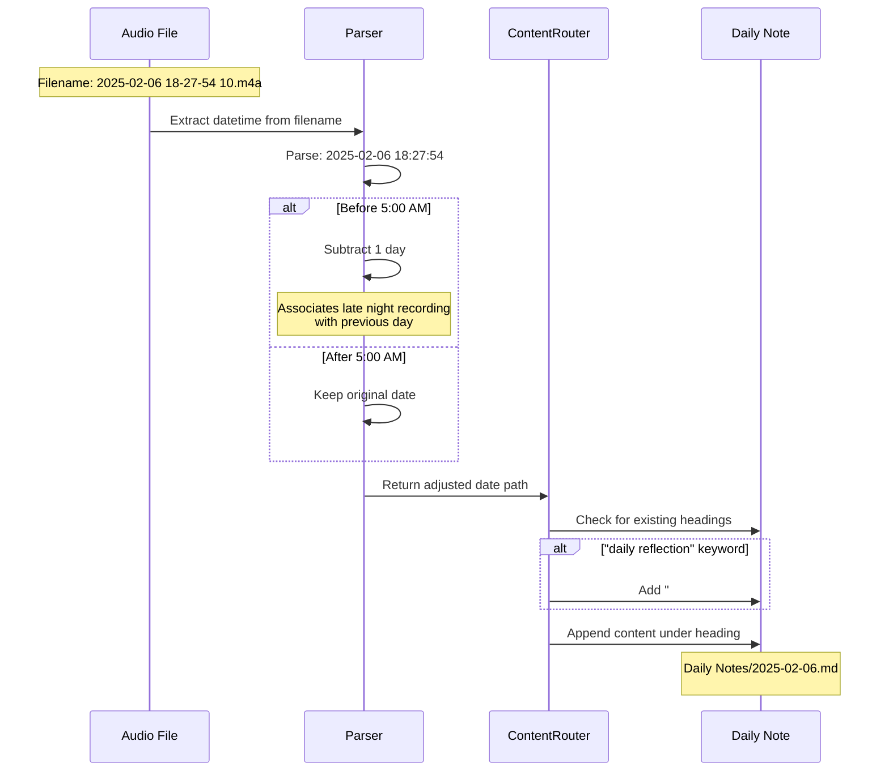
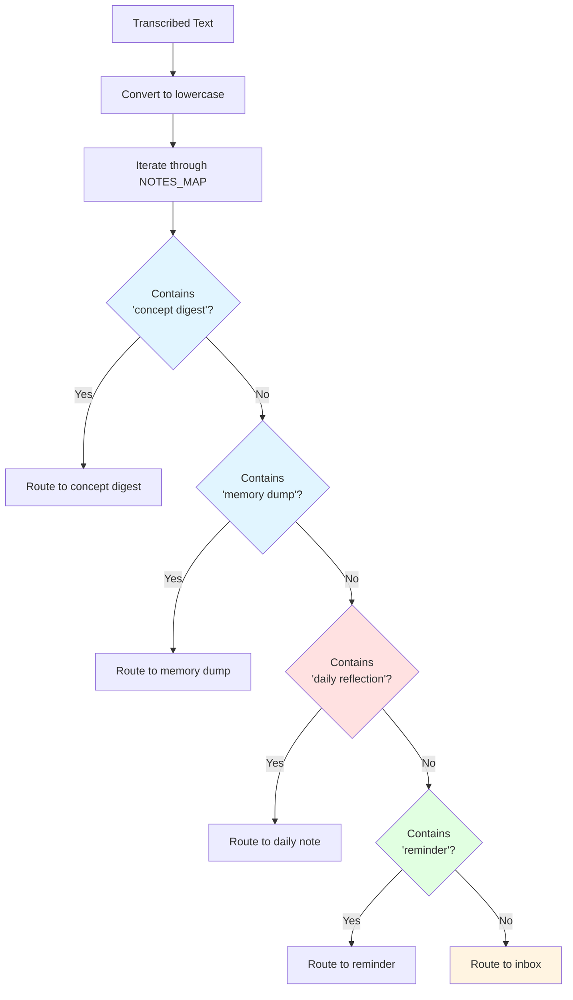

# Content Routing System

## Keyword Detection & Routing Logic

```mermaid
flowchart TD
    START[Transcribed Text] --> STRIP[Strip whitespace]
    STRIP --> CHECK{Check keywords<br/>in content}
    
    CHECK -->|concept digest| CD[Target: ZettleKasten/<br/>concept digest.md]
    CHECK -->|memory dump| MD[Target: ZettleKasten/<br/>memory dump.md]
    CHECK -->|daily reflection| DR[Target: Daily Notes/<br/>YYYY-MM-DD.md]
    CHECK -->|reminder| REM[Target: fleet_notes/<br/>reminders/FILENAME.md]
    CHECK -->|No match| INBOX[Target: Obsidian/<br/>gtd - inbox.md]
    
    subgraph "Daily Reflection Processing"
        DR --> PARSE[Parse date from filename]
        PARSE --> HOUR{Recording time<br/>before 5am?}
        HOUR -->|Yes| ADJ[Adjust date -1 day]
        HOUR -->|No| KEEP[Keep original date]
        ADJ --> DAILY1[Daily Notes/YYYY-MM-DD.md]
        KEEP --> DAILY1
    end
    
    subgraph "Reminder Processing"
        REM --> TEMPLATE1[Create reminder template<br/>tags: reminder<br/>text: content]
        TEMPLATE1 --> INDIVIDUAL[Create individual .md file]
    end
    
    CD --> LENGTH
    MD --> LENGTH
    DAILY1 --> LENGTH
    INBOX --> LENGTH
    
    LENGTH{Content length<br/>> 200 chars?}
    
    LENGTH -->|Yes| LONG[Create full note in<br/>fleet_notes/voice_memo/]
    LENGTH -->|No| SHORT[Append content directly]
    
    LONG --> LINK[Append wiki-link + preview<br/>to target note]
    LINK --> DONE[Complete]
    SHORT --> DONE
    INDIVIDUAL --> DONE
    
    style CHECK fill:#e1f5ff
    style LENGTH fill:#fff4e1
    style DR fill:#ffe1e1
    style REM fill:#e1ffe1
```

## Notes Map Configuration

```mermaid
graph LR
    subgraph "NOTES_MAP Dictionary"
        A["concept digest"] --> B[ZettleKasten/concept digest.md]
        C["memory dump"] --> D[ZettleKasten/memory dump.md]
        E["daily reflection"] --> F["daily" special handler]
        G["reminder"] --> H["reminder" special handler]
    end
    
    F --> F1[Parse timestamp from filename]
    F --> F2[Adjust for early morning <5am]
    F --> F3[Route to Daily Notes/DATE.md]
    
    H --> H1[Create frontmatter template]
    H --> H2[Individual file per reminder]
    H --> H3[Store in fleet_notes/reminders/]
    
    style A fill:#e1f5ff
    style C fill:#e1f5ff
    style E fill:#ffe1e1
    style G fill:#e1ffe1
```

## Content Length Handling

```mermaid
flowchart TD
    CONTENT[Transcribed Content] --> CHECK{Length check}
    
    CHECK -->|<= 200 chars| SHORT[Short Note Handler]
    CHECK -->|> 200 chars| LONG[Long Note Handler]
    
    subgraph "Short Note Processing"
        SHORT --> FORMAT1["Format:<br/>- FILENAME --VM--<br/>  - content"]
        FORMAT1 --> APPEND1[Append directly to target]
    end
    
    subgraph "Long Note Processing"
        LONG --> CREATE[Create individual .md file]
        CREATE --> TEMPLATE["Add frontmatter:<br/>date_creation<br/>time_creation<br/>tags: #voice_memo"]
        TEMPLATE --> FULLTEXT[Write full content]
        FULLTEXT --> PREVIEW[Extract first 200 chars]
        PREVIEW --> FORMAT2["Format:<br/>- [[FILENAME]] --VM--<br/>  - preview..."]
        FORMAT2 --> APPEND2[Append wiki-link to target]
    end
    
    APPEND1 --> TARGET[Target Note]
    APPEND2 --> TARGET
    
    CREATE -.-> VOICEMEMO[fleet_notes/voice_memo/*.md]
    
    style SHORT fill:#e1ffe1
    style LONG fill:#fff4e1
    style CREATE fill:#ffe1e1
```

## Daily Note Special Handling

```mermaid
sequenceDiagram
    participant F as Audio File
    participant P as Parser
    participant C as ContentRouter
    participant D as Daily Note
    
    Note over F: Filename: 2025-02-06 18-27-54 10.m4a
    
    F->>P: Extract datetime from filename
    P->>P: Parse: 2025-02-06 18:27:54
    
    alt Before 5:00 AM
        P->>P: Subtract 1 day
        Note over P: Associates late night recording<br/>with previous day
    else After 5:00 AM
        P->>P: Keep original date
    end
    
    P->>C: Return adjusted date path
    C->>D: Check for existing headings
    
    alt "daily reflection" keyword
        C->>D: Add "## daily reflection" if missing
    end
    
    C->>D: Append content under heading
    
    Note over D: Daily Notes/2025-02-06.md<br/>## daily reflection<br/>- content...
```

## Keyword Matching Priority

```mermaid
flowchart TD
    START[Transcribed Text] --> LOWER[Convert to lowercase]
    LOWER --> ITER[Iterate through NOTES_MAP]
    
    ITER --> K1{Contains<br/>'concept digest'?}
    K1 -->|Yes| R1[Route to concept digest]
    K1 -->|No| K2
    
    K2{Contains<br/>'memory dump'?}
    K2 -->|Yes| R2[Route to memory dump]
    K2 -->|No| K3
    
    K3{Contains<br/>'daily reflection'?}
    K3 -->|Yes| R3[Route to daily note]
    K3 -->|No| K4
    
    K4{Contains<br/>'reminder'?}
    K4 -->|Yes| R4[Route to reminder]
    K4 -->|No| DEFAULT
    
    DEFAULT[Route to inbox]
    
    style K1 fill:#e1f5ff
    style K2 fill:#e1f5ff
    style K3 fill:#ffe1e1
    style K4 fill:#e1ffe1
    style DEFAULT fill:#fff4e1
```
