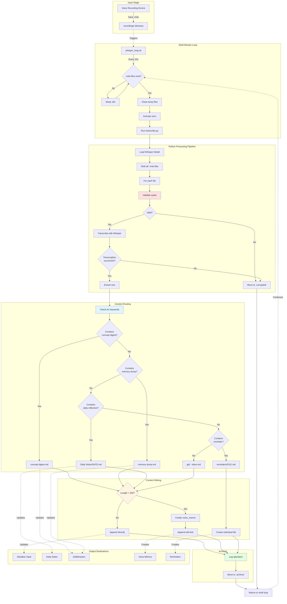
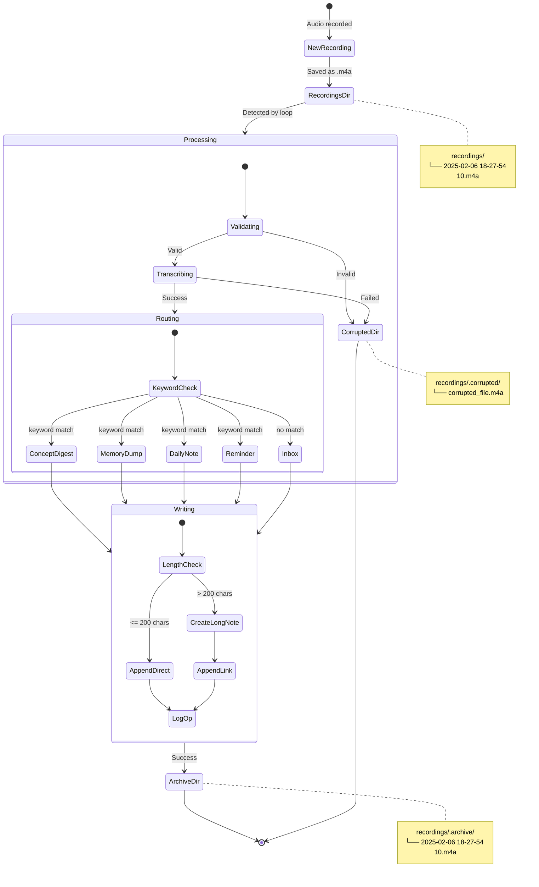
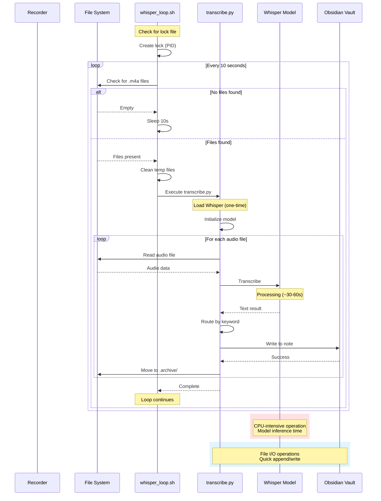
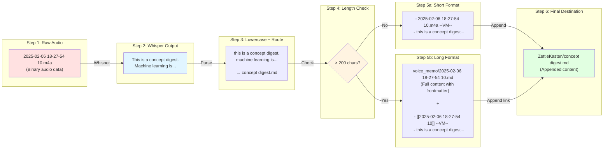

# Complete Data Flow

## End-to-End Processing Pipeline

```mermaid
flowchart TB
    subgraph "Input Stage"
        A[Voice Recording Device] -->|Save .m4a| B[recordings/ directory]
    end
    
    subgraph "Shell Monitor Loop"
        C[whisper_loop.sh] -->|Every 10s| D{.m4a files exist?}
        D -->|No| E[Sleep 10s]
        E --> D
        D -->|Yes| F[Clean temp files]
        F --> G[Activate venv]
        G --> H[Run transcribe.py]
    end
    
    B -.->|Triggers| C
    
    subgraph "Python Processing Pipeline"
        H --> I[Load Whisper Model]
        I --> J[Glob all .m4a files]
        J --> K[For each file]
        
        K --> L[Validate audio]
        L --> M{Valid?}
        M -->|No| N[Move to .corrupted/]
        M -->|Yes| O[Transcribe with Whisper]
        
        O --> P{Transcription<br/>successful?}
        P -->|No| N
        P -->|Yes| Q[Extract text]
    end
    
    subgraph "Content Routing"
        Q --> R[Check for keywords]
        R --> S1{Contains<br/>concept digest?}
        S1 -->|Yes| T1[concept digest.md]
        
        S1 -->|No| S2{Contains<br/>memory dump?}
        S2 -->|Yes| T2[memory dump.md]
        
        S2 -->|No| S3{Contains<br/>daily reflection?}
        S3 -->|Yes| T3[Daily Notes/DATE.md]
        
        S3 -->|No| S4{Contains<br/>reminder?}
        S4 -->|Yes| T4[reminders/FILE.md]
        
        S4 -->|No| T5[gtd - inbox.md]
    end
    
    subgraph "Content Writing"
        T1 --> W1{Length > 200?}
        T2 --> W1
        T3 --> W1
        T5 --> W1
        
        W1 -->|No| W2[Append directly]
        W1 -->|Yes| W3[Create voice_memo/]
        W3 --> W4[Append wiki-link]
        
        T4 --> W5[Create individual file]
    end
    
    subgraph "Archival"
        W2 --> X[Log operation]
        W4 --> X
        W5 --> X
        X --> Y[Move to .archive/]
    end
    
    subgraph "Output Destinations"
        Z1[Obsidian Vault]
        Z2[Daily Notes]
        Z3[ZettleKasten]
        Z4[Voice Memos]
        Z5[Reminders]
    end
    
    W2 -.->|Updates| Z1
    W4 -.->|Creates| Z4
    W5 -.->|Creates| Z5
    T3 -.->|Updates| Z2
    T1 -.->|Updates| Z3
    T2 -.->|Updates| Z3
    
    Y --> AA[Return to shell loop]
    N --> AA
    AA -.->|Continues| D
    
    style L fill:#ffe1e1
    style R fill:#e1f5ff
    style W1 fill:#fff4e1
    style X fill:#e1ffe1
```

## File System State Changes

```mermaid
stateDiagram-v2
    [*] --> NewRecording: Audio recorded
    
    NewRecording --> RecordingsDir: Saved as .m4a
    
    RecordingsDir --> Processing: Detected by loop
    
    state Processing {
        [*] --> Validating
        Validating --> Transcribing: Valid
        Validating --> CorruptedDir: Invalid
        Transcribing --> Routing: Success
        Transcribing --> CorruptedDir: Failed
    }
    
    state Routing {
        [*] --> KeywordCheck
        KeywordCheck --> ConceptDigest: keyword match
        KeywordCheck --> MemoryDump: keyword match
        KeywordCheck --> DailyNote: keyword match
        KeywordCheck --> Reminder: keyword match
        KeywordCheck --> Inbox: no match
    }
    
    ConceptDigest --> Writing
    MemoryDump --> Writing
    DailyNote --> Writing
    Reminder --> Writing
    Inbox --> Writing
    
    state Writing {
        [*] --> LengthCheck
        LengthCheck --> AppendDirect: <= 200 chars
        LengthCheck --> CreateLongNote: > 200 chars
        CreateLongNote --> AppendLink
        AppendDirect --> LogOp
        AppendLink --> LogOp
    }
    
    Writing --> ArchiveDir: Success
    ArchiveDir --> [*]
    CorruptedDir --> [*]
    
    note right of RecordingsDir
        recordings/
        └── 2025-02-06 18-27-54 10.m4a
    end note
    
    note right of ArchiveDir
        recordings/.archive/
        └── 2025-02-06 18-27-54 10.m4a
    end note
    
    note right of CorruptedDir
        recordings/.corrupted/
        └── corrupted_file.m4a
    end note
```

## Timing & Concurrency

```mermaid
sequenceDiagram
    participant R as Recorder
    participant F as File System
    participant L as whisper_loop.sh
    participant P as transcribe.py
    participant W as Whisper Model
    participant O as Obsidian Vault
    
    Note over L: Check for lock file
    L->>L: Create lock (PID)
    
    loop Every 10 seconds
        L->>F: Check for .m4a files
        
        alt No files found
            F-->>L: Empty
            L->>L: Sleep 10s
        else Files found
            F-->>L: Files present
            L->>L: Clean temp files
            L->>P: Execute transcribe.py
            
            Note over P: Load Whisper (one-time)
            P->>P: Initialize model
            
            loop For each audio file
                P->>F: Read audio file
                F-->>P: Audio data
                
                P->>W: Transcribe
                Note over W: Processing (~30-60s)
                W-->>P: Text result
                
                P->>P: Route by keyword
                P->>O: Write to note
                O-->>P: Success
                
                P->>F: Move to .archive/
            end
            
            P-->>L: Complete
            Note over L: Loop continues
        end
    end
    
    rect rgb(255, 225, 225)
        Note over W: CPU-intensive operation<br/>Model inference time
    end
    
    rect rgb(225, 245, 255)
        Note over P,O: File I/O operations<br/>Quick append/write
    end
```

## Resource Usage Pattern

```mermaid
gantt
    title Processing Timeline for Single Audio File
    dateFormat ss
    axisFormat %S
    
    section Shell Loop
    Poll directory         :done, t1, 00, 1s
    Detect file           :done, t2, 01, 1s
    Clean temp files      :done, t3, 02, 1s
    Activate venv         :done, t4, 03, 1s
    Launch Python         :done, t5, 04, 1s
    
    section Python Init
    Load Whisper model    :crit, t6, 05, 10s
    Glob audio files      :done, t7, 15, 1s
    
    section Processing
    Validate file         :done, t8, 16, 2s
    Transcribe (Whisper)  :crit, t9, 18, 45s
    Route content         :done, t10, 63, 1s
    Write to note         :done, t11, 64, 1s
    Move to archive       :done, t12, 65, 1s
    
    section Return
    Python exit           :done, t13, 66, 1s
    Shell continues       :done, t14, 67, 1s
    Sleep 10s             :active, t15, 68, 10s
    
    section Next Cycle
    Poll again            :t16, 78, 1s
```

## Data Transformation Steps

```mermaid
flowchart LR
    subgraph "Step 1: Raw Audio"
        A["2025-02-06 18-27-54 10.m4a<br/>(Binary audio data)"]
    end
    
    subgraph "Step 2: Whisper Output"
        B["This is a concept digest.<br/>Machine learning is..."]
    end
    
    subgraph "Step 3: Lowercase + Route"
        C["this is a concept digest.<br/>machine learning is...<br/><br/>→ concept digest.md"]
    end
    
    subgraph "Step 4: Length Check"
        D{"> 200 chars?"}
    end
    
    subgraph "Step 5a: Short Format"
        E["- 2025-02-06 18-27-54 10.m4a --VM--<br/>  - this is a concept digest..."]
    end
    
    subgraph "Step 5b: Long Format"
        F["voice_memo/2025-02-06 18-27-54 10.md<br/>(Full content with frontmatter)<br/><br/>+<br/><br/>- [[2025-02-06 18-27-54 10]] --VM--<br/>  - this is a concept digest..."]
    end
    
    subgraph "Step 6: Final Destination"
        G["ZettleKasten/concept digest.md<br/>(Appended content)"]
    end
    
    A -->|Whisper| B
    B -->|Parse| C
    C -->|Check| D
    D -->|No| E
    D -->|Yes| F
    E -->|Append| G
    F -->|Append link| G
    
    style A fill:#ffe1e1
    style B fill:#e1f5ff
    style D fill:#fff4e1
    style G fill:#e1ffe1
```
