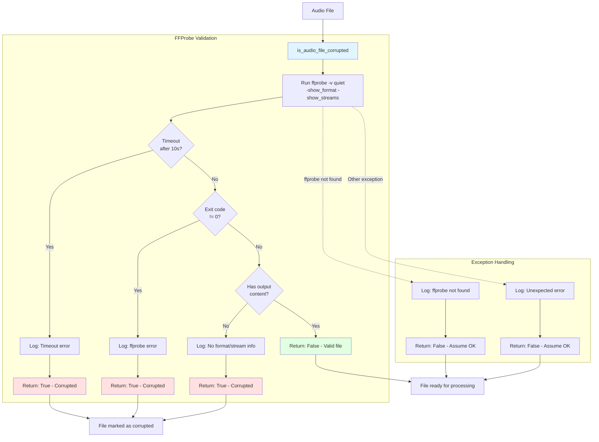
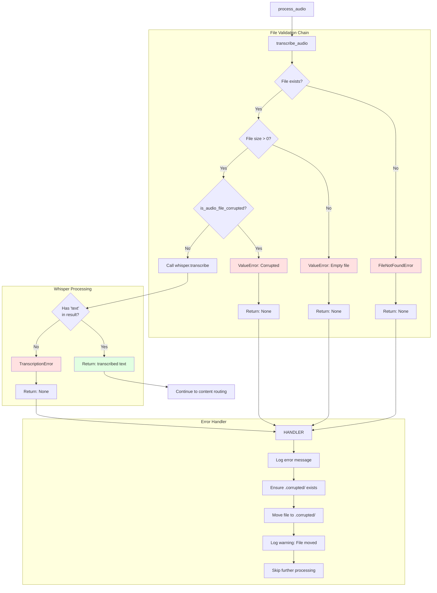
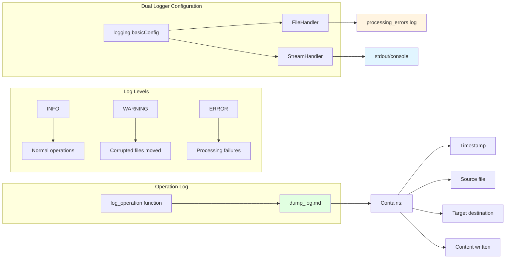
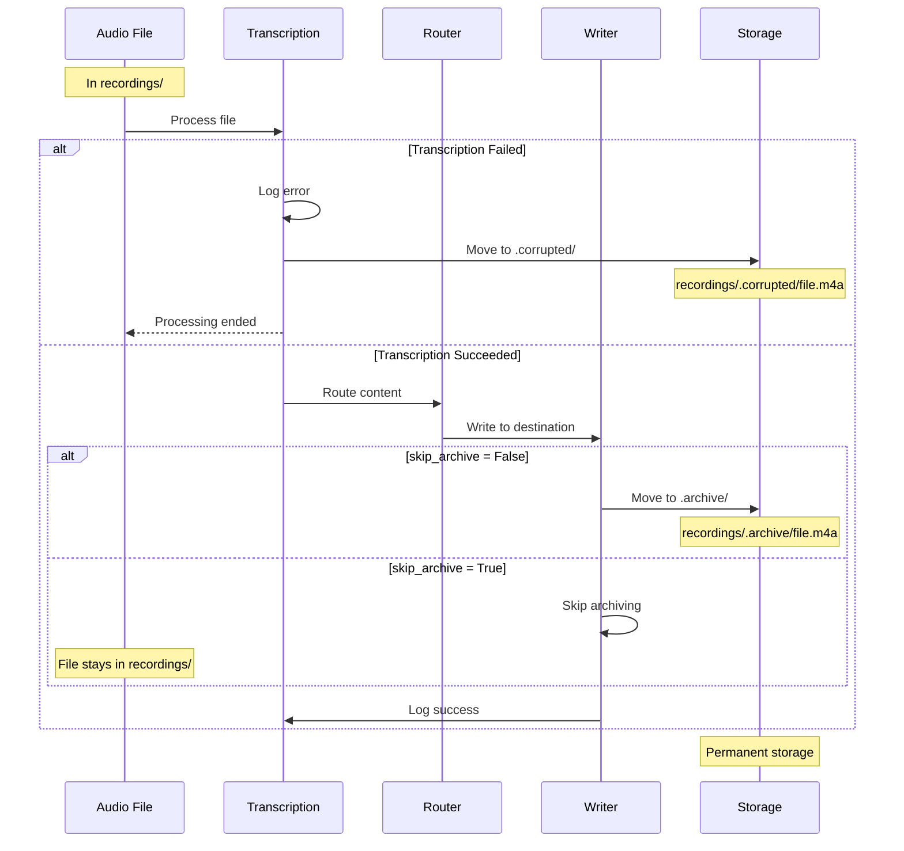
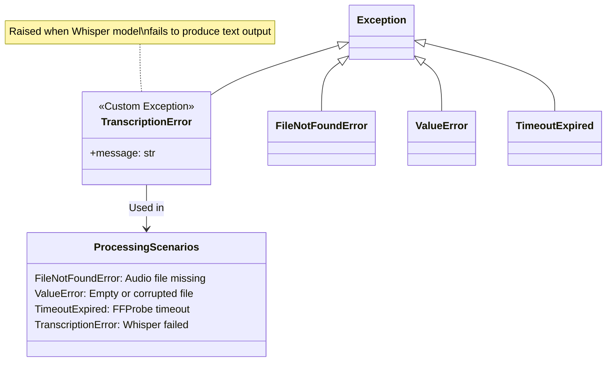
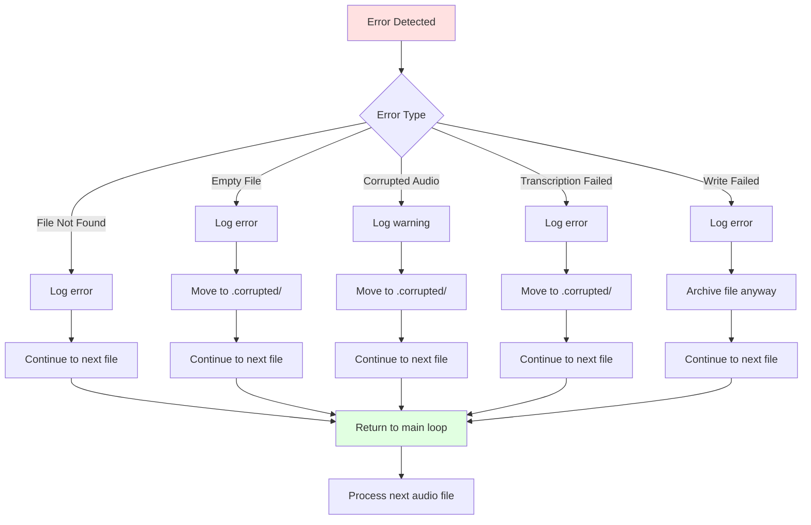

# Error Handling & File Validation

## Audio File Corruption Detection

## Transcription Error Flow

## Logging System

## Archive & Cleanup Flow

## Exception Hierarchy

## Error Recovery Strategy

