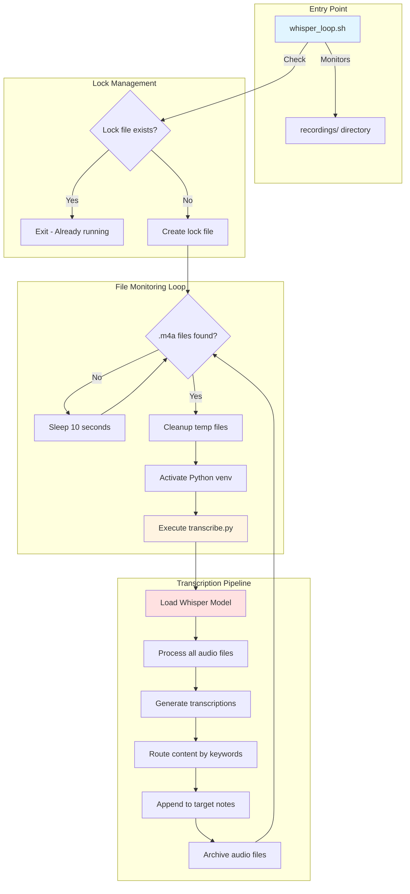

# System Overview: Voice Memo Transcription Pipeline

## High-Level Architecture

## Process Flow Summary

1. **Shell Script (`whisper_loop.sh`)**: Continuously monitors the recordings directory
2. **Lock Prevention**: Ensures only one instance runs at a time
3. **File Detection**: Checks for `.m4a` audio files every 10 seconds
4. **Python Invocation**: Triggers the transcription pipeline when files are found
5. **Content Processing**: Transcribes, routes, and archives voice memos
6. **Loop Continuation**: Returns to monitoring after processing completes
