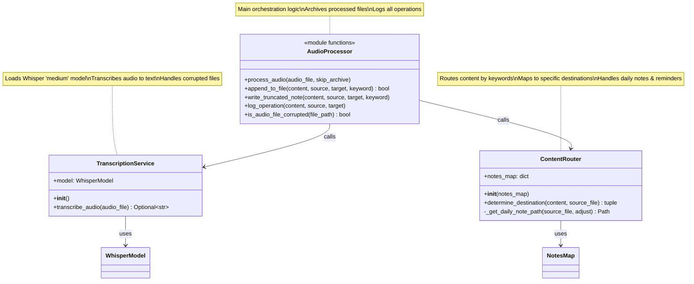
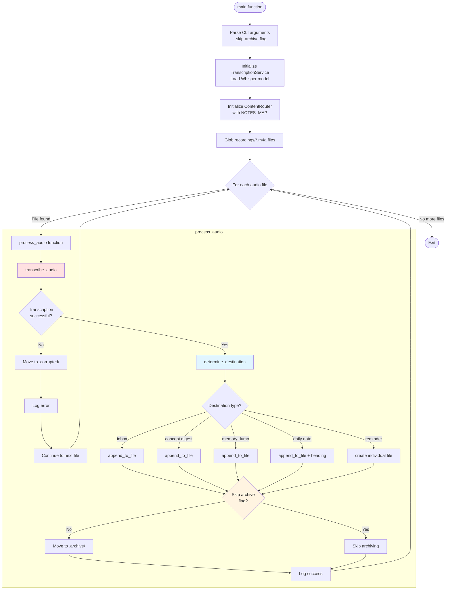
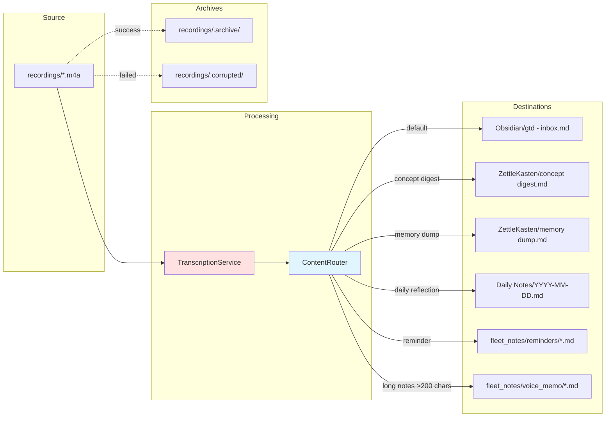

# transcribe.py - Python Script Architecture

## Class Structure & Relationships

```mermaid
classDiagram
    class TranscriptionService {
        +model: WhisperModel
        +__init__()
        +transcribe_audio(audio_file) Optional~str~
    }
    
    class ContentRouter {
        +notes_map: dict
        +__init__(notes_map)
        +determine_destination(content, source_file) tuple
        -_get_daily_note_path(source_file, adjust) Path
    }
    
    class AudioProcessor {
        <<module functions>>
        +process_audio(audio_file, skip_archive)
        +append_to_file(content, source, target, keyword) bool
        +write_truncated_note(content, source, target, keyword)
        +log_operation(content, source, target)
        +is_audio_file_corrupted(file_path) bool
    }
    
    TranscriptionService --> WhisperModel: uses
    ContentRouter --> NotesMap: uses
    AudioProcessor --> TranscriptionService: calls
    AudioProcessor --> ContentRouter: calls
    
    note for TranscriptionService "Loads Whisper 'medium' model\nTranscribes audio to text\nHandles corrupted files"
    note for ContentRouter "Routes content by keywords\nMaps to specific destinations\nHandles daily notes & reminders"
    note for AudioProcessor "Main orchestration logic\nArchives processed files\nLogs all operations"
```

## Main Execution Flow

```mermaid
flowchart TD
    START([main function]) --> PARSE[Parse CLI arguments<br/>--skip-archive flag]
    PARSE --> INIT1[Initialize TranscriptionService<br/>Load Whisper model]
    INIT1 --> INIT2[Initialize ContentRouter<br/>with NOTES_MAP]
    INIT2 --> GLOB[Glob recordings/*.m4a files]
    
    GLOB --> LOOP{For each audio file}
    LOOP -->|File found| PROC[process_audio function]
    LOOP -->|No more files| END([Exit])
    
    subgraph "process_audio"
        PROC --> TRANS[transcribe_audio]
        TRANS --> CORRUPT{Transcription<br/>successful?}
        
        CORRUPT -->|No| MOVE1[Move to .corrupted/]
        MOVE1 --> LOG1[Log error]
        LOG1 --> NEXT1[Continue to next file]
        
        CORRUPT -->|Yes| ROUTE[determine_destination]
        ROUTE --> DEST{Destination type?}
        
        DEST -->|inbox| APP1[append_to_file]
        DEST -->|concept digest| APP2[append_to_file]
        DEST -->|memory dump| APP3[append_to_file]
        DEST -->|daily note| APP4[append_to_file + heading]
        DEST -->|reminder| APP5[create individual file]
        
        APP1 --> ARCHIVE
        APP2 --> ARCHIVE
        APP3 --> ARCHIVE
        APP4 --> ARCHIVE
        APP5 --> ARCHIVE
        
        ARCHIVE{Skip archive<br/>flag?}
        ARCHIVE -->|No| MOVE2[Move to .archive/]
        ARCHIVE -->|Yes| SKIP[Skip archiving]
        
        MOVE2 --> LOG2[Log success]
        SKIP --> LOG2
    end
    
    LOG2 --> LOOP
    NEXT1 --> LOOP
    
    style TRANS fill:#ffe1e1
    style ROUTE fill:#e1f5ff
    style ARCHIVE fill:#fff4e1
```

## Directory Mapping

```mermaid
flowchart LR
    subgraph "Source"
        A[recordings/*.m4a]
    end
    
    subgraph "Processing"
        B[TranscriptionService]
        C[ContentRouter]
    end
    
    subgraph "Destinations"
        D1[Obsidian/gtd - inbox.md]
        D2[ZettleKasten/concept digest.md]
        D3[ZettleKasten/memory dump.md]
        D4[Daily Notes/YYYY-MM-DD.md]
        D5[fleet_notes/reminders/*.md]
        D6[fleet_notes/voice_memo/*.md]
    end
    
    subgraph "Archives"
        E1[recordings/.archive/]
        E2[recordings/.corrupted/]
    end
    
    A --> B
    B --> C
    C -->|default| D1
    C -->|concept digest| D2
    C -->|memory dump| D3
    C -->|daily reflection| D4
    C -->|reminder| D5
    C -->|long notes >200 chars| D6
    
    A -.->|success| E1
    A -.->|failed| E2
    
    style B fill:#ffe1e1
    style C fill:#e1f5ff
```
